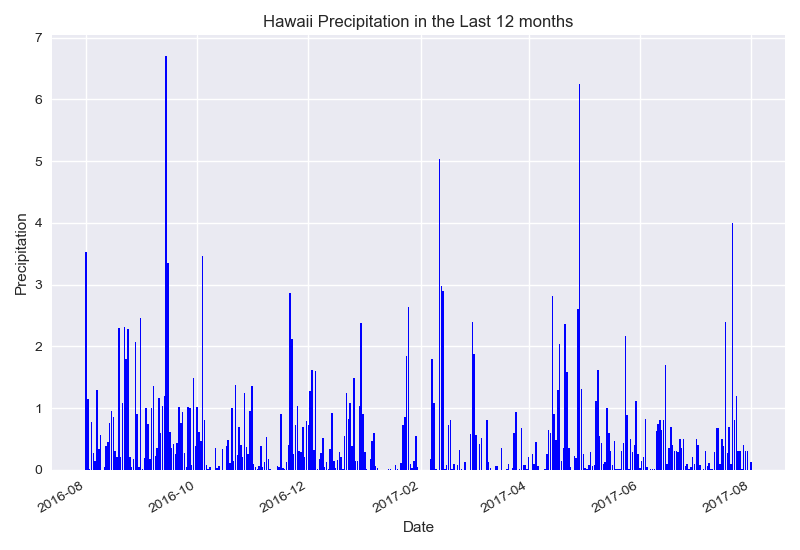

# Week11-Sequelize-SQLAlchemy
# SQLAlchemy climate analysis and climate analysis api on Hawaii

Congratulations! You've decided to treat yourself to a long holiday vacation in Honolulu, Hawaii! 
To help with your trip planning, you decided to do some climate analysis on the area. 
You have decided to share your ninja analytical skills with the community by providing a climate analysis api.

The following outlines what you need to do.

## Step 1 - Data Engineering
        Create Jupyter Notebook file called `data_engineering.ipynb` and use this to complete all of your Data Engineering tasks.
## Step 2 - Database Engineering
        Use SQLAlchemy to model your table schemas and create a sqlite database for your tables. 
        Create a Jupyter Notebook called `database_engineering.ipynb` and use this to complete all of your Database Engineering work.
## Step 3 - Climate Analysis and Exploration
        Use Python and SQLAlchemy to do basic climate analysis and data exploration on your new weather station tables. 
        All of the following analysis should be completed using SQLAlchemy ORM queries, Pandas, and Matplotlib.
## Step 4 - Climate App
        Now that you have completed your initial analysis, design a Flask api based on the queries that you have just developed.
        Use FLASK to create your routes.

# Fetching Resources
Fetch the required resources using the fetch_data.py script.

python fetch_data.py
Troubleshooting
Note that we are using the datadotworld-py Python api to fetch our dataset. You must install the library to use the fetch script.

# Install datadotworld-py
conda install -c conda-forge datadotworld-py
Or with pip

pip install datadotworld-py

#  How to create a folder in Github

     You cannot create an empty folder and then add files to that folder, but rather creation of a folder must happen together with adding      of at least a single file. On github you can do it this way:

     go to the folder inside which you want to create another folder
     click on New file
     on the text field for the file name, first write the folder name you want to create
     then type /, this creates a folder
     you can add more folders similarly
     finally, give the new file a name, (eg. .gitkeep which is usually used to make git track otherwise empty folders) and finally click        Commit new file.
